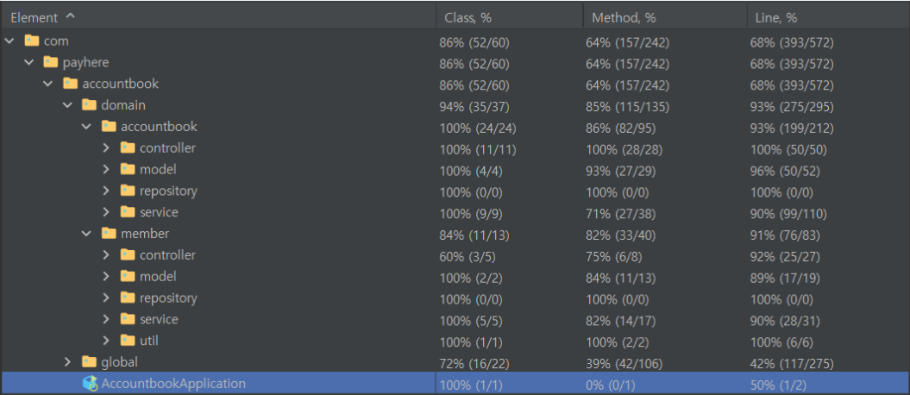

# payhere-accountbook
## 실행방법
1. [구글드라이브](https://drive.google.com/drive/folders/11nl_p-KfaZ_MoOgBteQo-aWzSKplNccm?usp=sharing)에 접속한 후 `docker-compose.yml` 를 다운로드한다.
2. 다운로드 디렉토리에서 cmd 접속 후 `docker-compose up -d` 명령어를 실행한다.(20초 정도 지나면 실행이 됩니다)
3. MySQL 포트 설정 : `3306`, Spring 포트 설정 : `8080` - 해당 포트를 사용중이라면 정지후 재실행한다.
4. `http://localhost:8080` 에 접속 시 REST DOCS 문서를 확인할 수 있다.
5. REST DOCS 문서를 통해 API 테스트 진행할 수 있습니다(POST MAN)

## 개발일정
**feat1 (220924-220925)** : 공통 설정 추가(JPA Audit, Error 핸들링, Security), JWT 토큰 추가, AccessToken, RefreshToken 기반의 인증 filter 작성<br>
**feat2 (220925-220906)** : Member 모델 작성, Member 회원가입 로그인 로그아웃 controller, service 로직 및 테스트 코드 작성, JWT 기반 인증 인가 POST Man 테스트 및 로직 완성, 토큰 타입 BL 체크 로직 추가<br>
**feat3 (220926-220927)** : book, bookCase CRUD, bookCase soft delete 적용, 서비스 테스트 코드 작성, 컨트롤러 테스트 코드 작성, rest-docs 최산화<br>
**feat4 (220927-220928)** : Book, BookCase 전체 조회 로직 추가, 삭제된 가계부(단건) 전체조회 및 복구 로직 작성 테스트 코드 추가, POST MAN 최종 테스트(전체 통과), Member password Bcrypt 암호화 적용

## 설계
### 공통 설계
- RestControllerAdvice 와 Custom한 ErrorCode 를 통해 예외를 전역적으로 관리합니다.
  - 해당 ErrorCode 는 프론트와 공유합니다.

### 인증 인가
- Spring Security 와 JWT(AccessToken, RefreshToken)을 활용하였습니다.
- accessToken 은 클라이언트 local storage 에 저장하고 refreshtoken 은 MySQL 에 Member entity 에 저장됩니다
  - (만료된 accesstoken 값을 확인하기 위해 accesstoken 값도 같이 저장됩니다.)
- 최초 회원가입 시 AccessToken 을 클라이언트에 전달하고 클라이언트는 해당 토큰을 local storage 에 저장한 후 request Authorization 헤더에 Bearer {accessTokenValue} 를 담아서 요청을 해야 합니다.
- `"/"`,`"/api/v1/signup"`, `"api/v1/login"`, `"api/v1/logout"` 해당 경로는 permitall 로 권한을 열어두었으며 `"/api/v1/book/**"`,`"/api/v1/bookcase/**"`,`"/api/v1/memo/**"` 경로는 토큰값을 헤더에 담지 않으면 denied 되며 exceptionHandling 를 통해 `"/"` 경로로 redirect 됩니다.
- filter 를 통해 토큰 만료시 분기처리합니다.
  - 1.accessToken, RefreshToken 모두 유효한 경우 
    - 정상처리			
  - 2.accessToken 은 유효하지만, refreshToken 이 만료 
    - accessToken 을 검증하여 refreshToken 재발급(T002 에러 발생 - 클라이언트는 해당 예외를 받으면 재요청합니다.)
  - 3.accessToken 만료, refreshToken 유효 
    - refreshToken 을 검증하여 accessToken 재발급(재발급된 AccessToken 값과 함께 T001 에러 발생 - 클라이언트는 재발급된 AccessToken 값으로 재요청합니다.)
  - 4.accessToken 과 refreshToken 모두 만료 
    - 에러발생(재로그인이 필요합니다.)

### 도메인
- Member 1:* Book 1:* BookCase
- Member : 멤버 도메인
- Book : 하루 가계부
  - 해당 일자로 BookCase 가 여러개 들어갈 수 있다, BookCase 가 추가될때 자동으로 Book 의 income 과 outcome 이 변경됩니다.
- BookCase : 1건에 해당하는 가계부
  - (예) 2022년 9월 28일에 해당하는 Book 에 커피한잔을 구매한 BookCase 가 추가됩니다.

### API
- 멤버인증
  - 회원가입 : POST /api/v1/signup
  - 로그인 : POST /api/v1/login
  - 로그아웃 : POST /api/v1/logout

- 가계부(일) - Book
- (Authorization header 에 `Bearer {accesstoken value}` 를 담지 않으면 access denied 됩니다.)
  - 단건조회 : GET /api/v1/book/{bookId}
  - 전체조회 : GET /api/v1/book
  - 등록 : POST /api/v1/book
  - 수정 : PATCH /api/v1/book

- 가계부(단건) - BookCase
- (Authorization header 에 `Bearer {accesstoken value}` 를 담지 않으면 access denied 됩니다.)
  - 단건조회 : GET /api/v1/book/{bookId}/bookcase/{bookCaseId}
  - 전체조회 : GET /api/v1/book/{bookId}/bookcase
  - 등록 : POST /api/v1/book/{bookId}/bookcase
  - 수정 : PATCH /api/v1/book/{bookId}/bookcase
  - 삭제(soft delete) : DELETE /api/v1/book/{bookId}/bookcase
  - 삭제된 가계부(단건) 전체조회 : GET /api/v1/book/{bookId}/bookcase/is-deleted
  - 삭제된 가게부(단건) 복구 : PATCH /api/v1/book/{bookId}/bookcase/is-deleted

### Soft delete
- BookCase 엔티티에 `@Wherer` 과 `SQLDelete` 를 활용하여 진행
```java
@Entity
@Getter
@NoArgsConstructor(access = AccessLevel.PROTECTED)
@SQLDelete(sql = "UPDATE book_case SET is_delete = true WHERE book_case_id = ?")
@Where(clause = "is_delete = false")
public class 
BookCase extends BaseEntity {
```
- soft delete 된 BookCase 를 복구하기 위해 `@Query(nativeQuery = true)` 를 활용
```java

public interface BookCaseRepository extends JpaRepository<BookCase, Long> {

	@Query(value = "select * from book_case where book_case_id = :bookCaseId", nativeQuery = true)
	Optional<BookCase> findBookCaseByIdIgnoreWhere(@Param("bookCaseId") Long bookCaseId);

	@Query(value = "select * from book_case where book_id = :bookId and is_delete = true", nativeQuery = true)
	List<BookCase> findByBookIsDeleted(@Param("bookId") Long bookId);
}

```

### 추가 개발사항
- 비밀번호 저장시 Bcrypt 를 활용한 PasswordEncoder 로 encode 되어 저장됩니다.
- Book, BookCase 엔티티에 `createdAt`, `updatedAt`,`createdBy`,`updatedBy`가 추가됩니다.
  - `createdBy` 와 `updatedBy` 에는 Member의 id 값이 담깁니다.
- controller 는 단위테스트로 service 는 통합테스트로 진행하였습니다
- 테스트 커버리지

